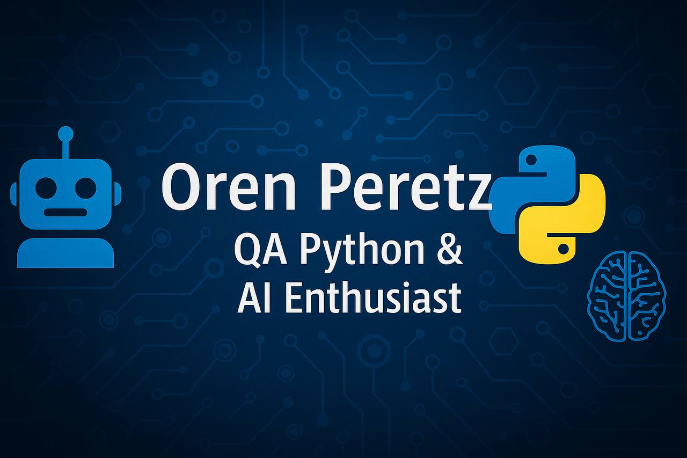

# 👋 Hi, I'm Oren!

### 💻 Junior QA & Data Enthusiast  
🔍 Learning QA, Python & AI  
🧪 Practicing test automation with Selenium  
🎓 Studying via Coursera, Google Cloud, Udemy & LinkedIn Learning  
🎯 My goal: land a QA/Data/AI role at companies like Microsoft or NVIDIA

---

## 🔧 Technologies & Tools

---

## 📜 Certificates

- [Meta Data Analyst – Coursera](https://www.coursera.org/account/accomplishments/records/48W21ZA6L47E)
- [Generative AI – Google Cloud](https://www.cloudskillsboost.google/public_profiles/e4b15b3b-758a-48e4-a834-a90f59187e01)
- [Selenium WebDriver – Udemy](https://ude.my/UC-2a79ffcb-c299-4e85-b3b2-7acdf2d87ac1)
- [AI Applications – LinkedIn Learning](https://www.linkedin.com/learning/certificates/8567b85b4913696f9f459d6573ebe20fa84a0521240e2d9f00a4eafc6a1805d7)

---

## 📫 Contact Me

  

---

⭐ Thanks for visiting my profile!
